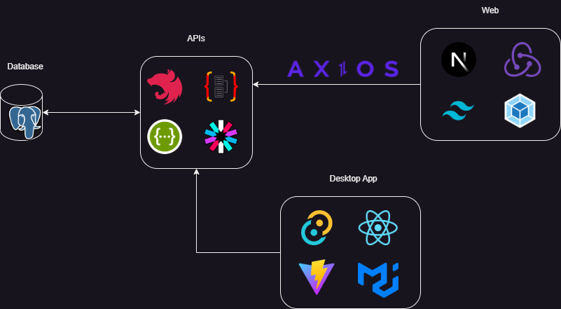

# Project Document v1.0.2

## Tech Stack

<figure><figcaption></figcaption></figure>

* Database: PostgreSQL
* Backend APIs:
  * Application Framework: NestJS
  * ORM: TypeORM
  * Authenticate & Authorization: JWT
  * Swagger UI
* Web:
  * FE Framework: NextJS (TypeScript)
  * UI Library: TailwindCSS&#x20;
  * State Management: Redux Toolkit
  * Module bundler: Webpack
* Desktop App:
  * Desktop Framework: Tauri&#x20;
  * FE Library: React + Redux
  * UI Library: MUI
  * Module bundler: Vite.
